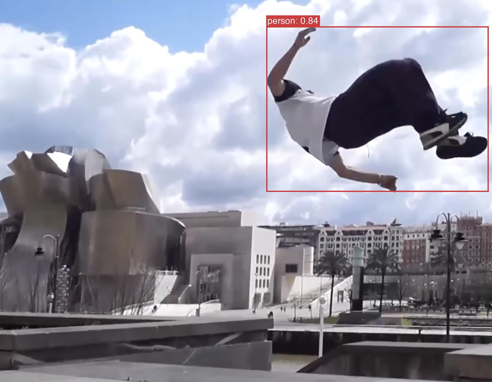

# LibreYOLO

[English](README.md) | [简体中文](README.zh-CN.md)

> **注意：** 本中文 README 由 AI 翻译，可能包含不准确或不自然的表述。请以英文 README 为准。

> ⭐ **支持 LibreYOLO。** 帮助项目最好的方式是给仓库 **star**。如果你遇到问题或有建议，欢迎[打开 issue](https://github.com/LibreYOLO/libreyolo/issues/new)；也欢迎代码贡献（见 [CONTRIBUTING.md](CONTRIBUTING.md)）。

[](https://www.libreyolo.com/docs)
[](https://pypi.org/project/libreyolo/)
[](https://pepy.tech/projects/libreyolo)
[](https://huggingface.co/LibreYOLO)
[](https://www.visionanalysis.org/)
[](https://www.linkedin.com/company/libreyolo/)
[](LICENSE)

LibreYOLO 是一个采用 MIT 许可证的计算机视觉库，支持多种模型的推理和训练。它提供熟悉的高层 Python 和命令行接口，并可读取常见的 YOLO 格式数据集，因此现有工作流只需少量改动即可迁移。



## 安装与快速开始

```bash
pip install libreyolo
```

如需从源码以可编辑模式安装（用于开发或跟踪尚未发布的改动）：

```bash
git clone https://github.com/LibreYOLO/libreyolo.git
cd libreyolo
pip install -e .
```

普通克隆会检出 `release` 分支，即代码与本文档一致的稳定分支。如需获取尚未发布的
最新开发内容，请使用 `git checkout dev` 切换到集成分支。

ONNX Runtime、OpenVINO、TensorRT、NCNN 和 RF-DETR 等可选运行时与导出依赖，请见[完整文档](https://www.libreyolo.com/docs)。

```python
from libreyolo import LibreYOLO, SAMPLE_IMAGE

model = LibreYOLO("LibreYOLO9t.pt")
result = model(SAMPLE_IMAGE, save=True)
```

## 旗舰模型

LibreYOLO 推荐以下模型系列，因为它们在性能上达到最佳平衡，并且接受最充分的测试：

- **YOLOv9**：基于 CNN 的 YOLO 模型。
- **RF-DETR**：基于 Transformer 的检测与分割模型。

## 兼容性

`✓` 表示支持。空单元格表示当前不支持。

<table>
  <thead>
    <tr>
      <th rowspan="2">模型系列</th>
      <th colspan="7">推理</th>
      <th rowspan="2">训练</th>
      <th colspan="6">导出格式</th>
    </tr>
    <tr>
      <th>检测</th>
      <th>分割</th>
      <th>语义分割</th>
      <th>分类</th>
      <th>姿态</th>
      <th>OBB</th>
      <th>视线</th>
      <th>ONNX</th>
      <th>TorchScript</th>
      <th>TensorRT</th>
      <th>OpenVINO</th>
      <th>NCNN</th>
      <th>TFLite (LiteRT)</th>
    </tr>
  </thead>
  <tbody>
    <tr><td><strong>⭐ YOLOv9</strong></td><td>✓</td><td></td><td></td><td></td><td></td><td></td><td></td><td>✓</td><td>✓</td><td>✓</td><td>✓</td><td>✓</td><td>✓</td><td></td></tr>
    <tr><td><strong>⭐ RF-DETR</strong></td><td>✓</td><td>✓</td><td>✓</td><td>✓</td><td>✓</td><td>✓</td><td></td><td>✓</td><td>✓</td><td>✓</td><td>✓</td><td>✓</td><td></td><td>✓</td></tr>
    <tr><td>YOLOX</td><td>✓</td><td></td><td></td><td></td><td></td><td></td><td></td><td>✓</td><td>✓</td><td>✓</td><td>✓</td><td>✓</td><td>✓</td><td></td></tr>
    <tr><td>YOLOv9-E2E</td><td>✓</td><td></td><td></td><td></td><td></td><td></td><td></td><td>✓</td><td>✓</td><td>✓</td><td>✓</td><td></td><td></td><td></td></tr>
    <tr><td>YOLOv9-P2</td><td>✓</td><td></td><td></td><td></td><td></td><td></td><td></td><td>✓</td><td>✓</td><td></td><td></td><td></td><td></td><td></td></tr>
    <tr><td>YOLO-NAS</td><td>✓</td><td></td><td></td><td></td><td>✓</td><td></td><td></td><td>✓</td><td>✓</td><td>✓</td><td>✓</td><td>✓</td><td>✓</td><td></td></tr>
    <tr><td>CenterNet</td><td>✓</td><td></td><td></td><td></td><td></td><td></td><td></td><td></td><td>✓</td><td>✓</td><td></td><td></td><td></td><td></td></tr>
    <tr><td>HRNet</td><td></td><td></td><td></td><td></td><td>✓</td><td></td><td></td><td></td><td>✓</td><td>✓</td><td>✓</td><td>✓</td><td></td><td></td></tr>
    <tr><td>D-FINE</td><td>✓</td><td></td><td></td><td></td><td></td><td></td><td></td><td>✓</td><td>✓</td><td>✓</td><td>✓</td><td>✓</td><td></td><td></td></tr>
    <tr><td>DEIM</td><td>✓</td><td></td><td></td><td></td><td></td><td></td><td></td><td>✓</td><td>✓</td><td>✓</td><td>✓</td><td>✓</td><td></td><td></td></tr>
    <tr><td>DEIMv2</td><td>✓</td><td></td><td></td><td></td><td></td><td></td><td></td><td>✓</td><td>✓</td><td>✓</td><td>✓</td><td>✓</td><td></td><td></td></tr>
    <tr><td>RT-DETR</td><td>✓</td><td></td><td></td><td></td><td></td><td></td><td></td><td>✓</td><td>✓</td><td>✓</td><td>✓</td><td>✓</td><td></td><td></td></tr>
    <tr><td>RT-DETRv2</td><td>✓</td><td></td><td></td><td></td><td></td><td></td><td></td><td>✓</td><td></td><td></td><td></td><td></td><td></td><td></td></tr>
    <tr><td>RT-DETRv4</td><td>✓</td><td></td><td></td><td></td><td></td><td></td><td></td><td>✓</td><td></td><td></td><td></td><td></td><td></td><td></td></tr>
    <tr><td>RetinaNet</td><td>✓</td><td></td><td></td><td></td><td></td><td></td><td></td><td></td><td>✓</td><td></td><td></td><td></td><td></td><td></td></tr>
    <tr><td>DINO-DETR</td><td>✓</td><td></td><td></td><td></td><td></td><td></td><td></td><td></td><td>✓</td><td>✓</td><td>✓</td><td>✓</td><td></td><td></td></tr>
    <tr><td>PicoDet</td><td>✓</td><td></td><td></td><td></td><td></td><td></td><td></td><td>✓</td><td>✓</td><td>✓</td><td></td><td></td><td></td><td></td></tr>
    <tr><td>RTMDet</td><td>✓</td><td></td><td></td><td></td><td></td><td></td><td></td><td>✓</td><td></td><td></td><td></td><td></td><td></td><td></td></tr>
    <tr><td>Mask R-CNN</td><td>✓</td><td>✓</td><td></td><td></td><td></td><td></td><td></td><td></td><td>✓</td><td></td><td></td><td></td><td></td><td></td></tr>
    <tr><td>EC</td><td>✓</td><td>✓</td><td></td><td></td><td>✓</td><td></td><td></td><td>✓</td><td></td><td></td><td></td><td></td><td></td><td></td></tr>
    <tr><td>ViT</td><td></td><td></td><td></td><td>✓</td><td></td><td></td><td></td><td></td><td>✓</td><td></td><td></td><td></td><td></td><td></td></tr>
    <tr><td>SSD300</td><td>✓</td><td></td><td></td><td></td><td></td><td></td><td></td><td></td><td>✓</td><td></td><td></td><td></td><td></td><td></td></tr>
    <tr><td>L2CS</td><td></td><td></td><td></td><td></td><td></td><td></td><td>✓</td><td></td><td></td><td></td><td></td><td></td><td></td><td></td></tr>
    <tr><td>VGG</td><td></td><td></td><td></td><td>✓</td><td></td><td></td><td></td><td></td><td>✓</td><td>✓</td><td>✓</td><td>✓</td><td></td><td></td></tr>
    <tr><td>Swin</td><td></td><td></td><td></td><td>✓</td><td></td><td></td><td></td><td></td><td>✓</td><td>✓</td><td>✓</td><td>✓</td><td></td><td></td></tr>
    <tr><td>DeepLabv3（语义）</td><td></td><td></td><td>✓</td><td></td><td></td><td></td><td></td><td></td><td>✓</td><td>✓</td><td>✓</td><td>✓</td><td></td><td></td></tr>
  </tbody>
</table>

## 许可证

- **代码：** MIT License
- **权重：** 预训练权重可能继承原始来源的许可证。请检查你感兴趣的具体 HF 权重仓库中的许可证。LibreYOLO HF 模型始终包含许可证。
